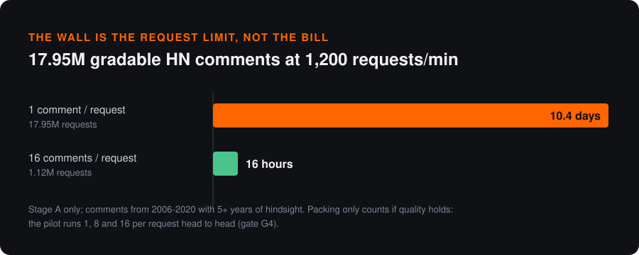
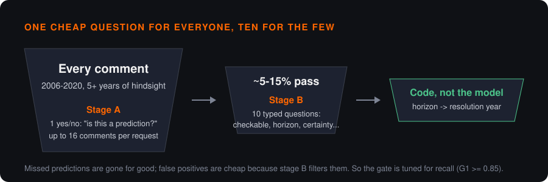
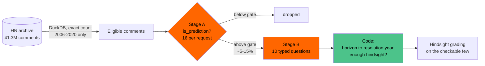
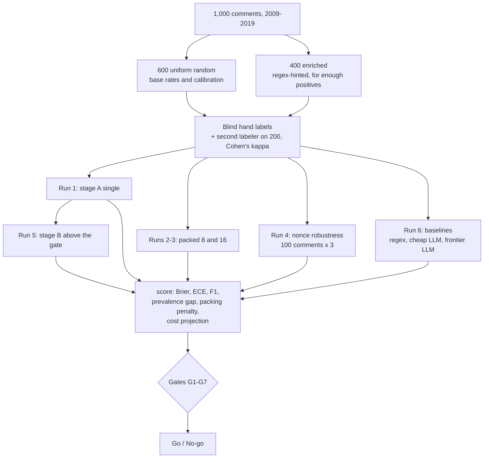
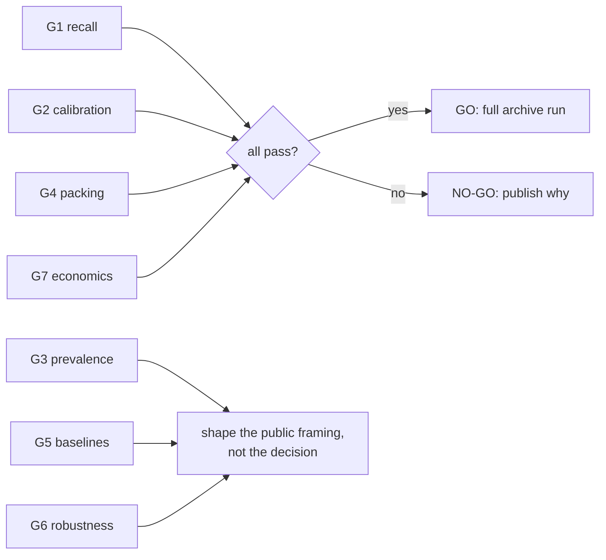

# hn-oracle

**Hacker News has spent 20 years predicting the future in its comment threads. I want to grade every one of those predictions, and this repo is the pre-registered test of whether that's affordable.**

<p align="center">
  
</p>

In December 2025 Andrej Karpathy pointed GPT-5.1 Thinking at the Hacker News front page from exactly ten years earlier: 930 threads from December 2015, graded in hindsight for about $60 and an hour of compute ([write-up](https://karpathy.bearblog.dev/auto-grade-hn/), [code](https://github.com/karpathy/hn-time-capsule), [results](https://karpathy.ai/hncapsule/)). It was a great demo, and it covered one month.

The full archive holds 41.3 million comments. A frontier LLM with web search can't grade all of them at that price, and it doesn't need to, because almost none of them are predictions. The real job is to find the few million comments that make a checkable claim about the future, tag them with calibrated probabilities, and save the expensive hindsight grading for those.

This repo is the 1,000-comment pilot that decides whether the full run happens. Every threshold was written down before the first API call, and every gate gets published as pass or fail, including the ones that fail.

> **Status:** built and tested end to end against a synthetic archive with mocked APIs; not yet run on real labels. Results, raw responses and labels get published here when it runs, pass or fail.

## The model: Jev

[Jev](https://docs.typesafe.ai) is TypeSafe's "System One" decision model. It generates no text. You hand it a state and a set of typed questions (**Noul** for yes/no, **Choice** for one-of-N, **Score** for a graded scale) and it returns a probability for each one. Input tokens cost $0.042 per million.

That shape fits this problem well. "Is this comment a prediction?" is a Noul. "What horizon does it claim?" is a Choice. "How certain does the author sound?" is a Score. There is no free text to parse or hallucinate, and nothing to prompt-engineer into valid JSON.

I've built on Jev before: [codex-decision-layer](https://github.com/anthony-maio/codex-decision-layer) uses it for evidence selection in Codex, and I maintain [awesome-jev](https://github.com/anthony-maio/awesome-jev).

## Where the cost actually comes from

My first estimate for the full archive was about $500 and 14 hours. It was wrong twice over.

Question text is billed as input tokens on every call. A full 10-question detail schema costs roughly 1,000 to 1,500 tokens per comment before the comment itself is even counted.

The bigger miss was time. At 1,200 requests per minute, one comment per request across 41.3M comments takes **23.9 days**, and no amount of token budget changes that number.

Two design changes follow, and the pilot tests both.

<p align="center">
  
</p>

**A two-stage cascade.** Stage A asks one short Noul of every comment. Stage B's ten questions run only on comments that clear the gate. The gate is tuned for recall, because a missed prediction is gone for good while a false positive just costs one more stage B call.

**Packing.** Stage A puts up to 16 comments in one request, each under its own ID. That turns 23.9 days into about 36 hours. It might also wreck quality: an independent benchmark found that 40-row batches failed a ranking gate that one row per request passed. So single, 8-packed and 16-packed runs go head to head, and gate G4 decides the largest pack size the full run may use.



## Calibrated probabilities you can add up

Accuracy isn't the most interesting claim here; calibration is.

If Jev's probabilities are calibrated, adding them up gives an honest estimate of how many predictions a set of comments contains, without anyone labeling them. You could chart how often HN predicted that Rust would win, year by year, and put error bars on it.

The pilot tests that directly. On the uniform random stratum, it compares the mean Jev probability with the hand-labeled rate and bootstraps a 95% interval on the gap. That's gate G3. If G3 fails, the trend charts ship as labeled counts and the write-up gets an honest section explaining why.

## The pilot



- **Two strata.** 600 comments are drawn uniformly at random, and only those feed base-rate, calibration and prevalence claims. Predictions are probably 3 to 8% of random comments, so 400 more come from comments matching a prediction-hint regex. That puts enough positives in the sample to test stage B.
- **Blind labels.** Every label is finished before anyone looks at a Jev output. The labeling tool never shows model output or the stratum. A second labeler covers 200 comments, and the human-human kappa sets the ceiling. I don't expect Jev to agree with me more than another person does.
- **The model never does arithmetic.** TypeSafe documents dates and numbers as weak spots, so no question asks Jev about dates. Horizon buckets become resolution years in code.
- **Robustness.** 100 comments are asked 3 times each with a random nonce added to the state. If the answers move, that's a finding.
- **Baselines** get the same state and the same question: the regex (uniform stratum only, since it built the enriched stratum), a cheap LLM, and a frontier LLM through OpenRouter structured output.

## Pre-registered gates

These were written before any Jev call. They can't change after the first call, and every one gets reported.

| Gate | Test | Threshold |
|---|---|---|
| **G1 recall** | stage A recall on the uniform stratum at the chosen gate | ≥ 0.85 |
| **G2 calibration** | ECE on the uniform stratum, raw or after held-out recalibration | ≤ 0.08 |
| **G3 prevalence** | recalibrated sum-of-probabilities vs. labeled rate | within ±2 pts, 95% CI includes 0 |
| **G4 packing** | packed F1 and Brier vs. single | F1 within 0.03, Brier ≤ 1.10× |
| **G5 baselines** | Jev F1 vs. regex / vs. frontier LLM | +0.15 / no worse than -0.05 |
| **G6 robustness** | median abs(Δp) across nonce repeats | ≤ 0.05 |
| **G7 economics** | projected full run, stage A + B | < $3,000 and < 7 days |
| **Stage B** | each field vs. human-human agreement | ≥ 80%, or the field ships as experimental |



## What the pilot costs

About ten dollars, and the labeling is the expensive part.

| Item | Cost |
|---|---|
| Jev, every pilot run combined (~1-3M input tokens) | under $1 |
| Cheap LLM baseline (`deepseek/deepseek-v4-flash`) | ~$0.04 |
| Frontier LLM baseline (`anthropic/claude-sonnet-5`) | ~$5 |
| Optional sweep of 7 low-cost models | ~$1 |
| Stage C hindsight spot check, 30 predictions with web search | ~$1 |
| Hand labeling | ~8 hours of my time |

OpenRouter's `:free` models work too (`--name free_frontier`, `--sweep free`), and packing 16 comments per request keeps a full baseline to 63 calls, under the free tier's daily cap. `python pilot.py models` prints the current free list and the cheapest paid models that support strict structured output.

## Run it

```bash
python -m venv .venv && .venv/Scripts/pip install -r requirements.txt
# .env: TYPESAFE_API_KEY=...  OPENROUTER_API_KEY=...

python pilot.py preflight --call        # dataset schema, Jev auth, packed-16 worst case
python pilot.py count                   # exact eligible comments, 2006-2020
python pilot.py sample                  # 600 uniform + 400 enriched, thread context
python pilot.py label --labeler you     # blind terminal labeler
python pilot.py run --mode a_single     # plus a_packed, a_nonce, b
python pilot.py baseline --kind llm --name cheap
python pilot.py score --labels data/labels_you.csv --single data/raw_a_single_v1.jsonl ...
python pilot.py publish                 # public artifacts, usernames removed
```

Every run is resumable and logs the full request, response, token usage and latency. The full day-by-day sequence is in [docs/RUNBOOK.md](docs/RUNBOOK.md), and the complete design is in [PILOT_PLAN.md](PILOT_PLAN.md).

Data comes from the [nikhilambhure00/hacker-news](https://huggingface.co/datasets/nikhilambhure00/hacker-news) mirror on Hugging Face, which DuckDB reads straight from monthly Parquet files. Thread context comes from the official HN Firebase API.

## What gets published

Everything: `questions.json`, every raw response, the labels, the report JSON, and a write-up that shows 10 misses and 10 false positives with their actual comment text. HN usernames are removed from every published artifact, and nothing in the pilot scores individual people.

Working title for the write-up: *I asked a decision model to find every prediction on Hacker News. Here's how calibrated it was.*

## Who built this

I'm [Anthony Maio](https://making-minds.ai): 20+ years as an IC, staff engineer turned AI safety researcher, and I build things like this on my own budget. I'm looking for my next role. If you're hiring for evals, applied ML infrastructure, or research engineering, I'd like to talk: open an issue or find me through the site.

## License

MIT
