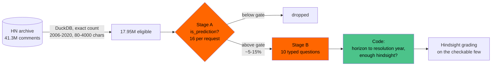
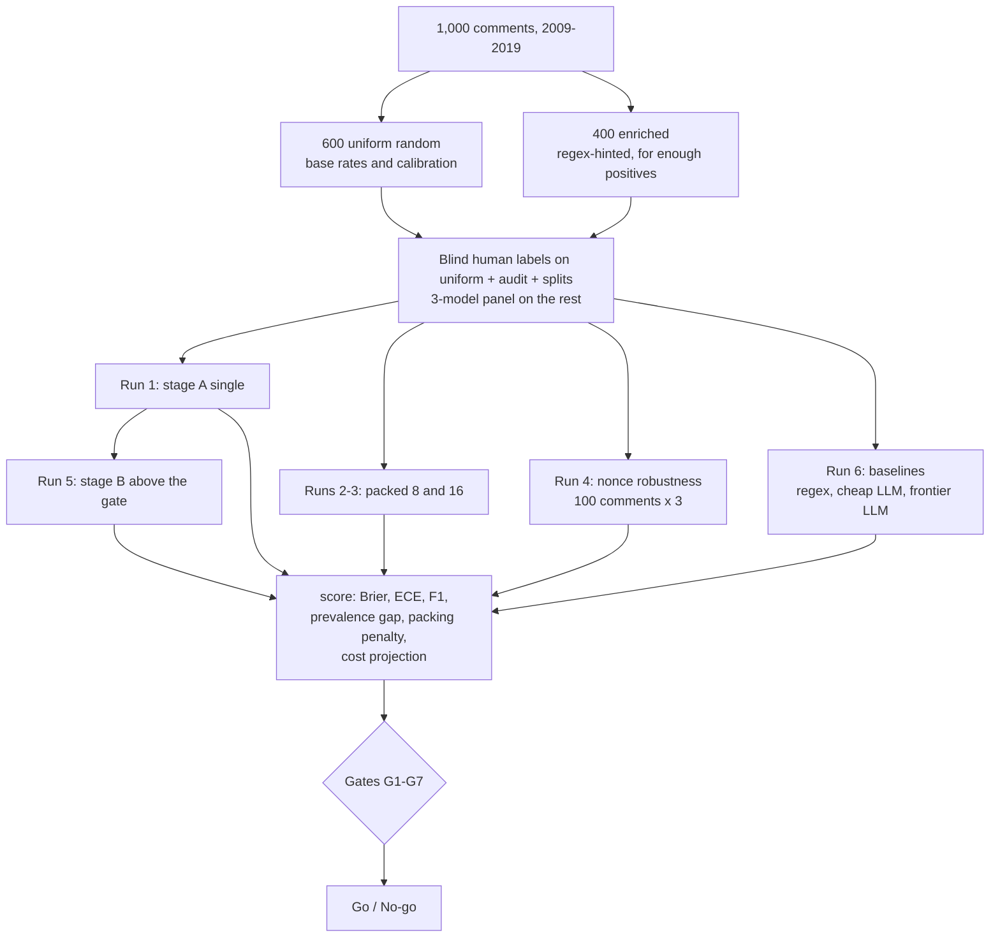
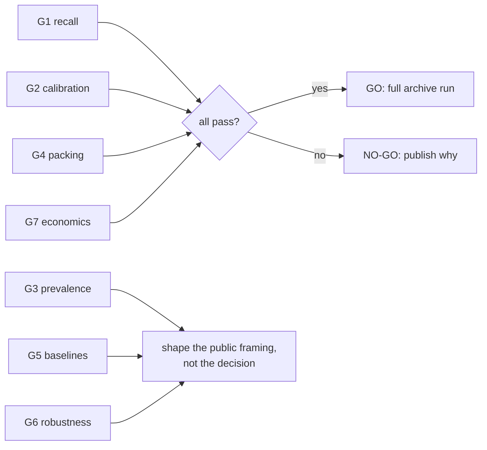

# hn-oracle

**Hacker News has spent 20 years predicting the future in its comment threads. I want to grade every one of those predictions, and this repo is the pre-registered test of whether that's affordable.**

<p align="center">
  
</p>

In December 2025 Andrej Karpathy pointed GPT-5.1 Thinking at the Hacker News front page from exactly ten years earlier: 930 threads from December 2015, graded in hindsight for about $60 and an hour of compute ([write-up](https://karpathy.bearblog.dev/auto-grade-hn/), [code](https://github.com/karpathy/hn-time-capsule), [results](https://karpathy.ai/hncapsule/)). It was a great demo, and it covered one month.

The archive holds 41.3 million comments. 17.95 million of them are from 2006-2020, have five or more years of hindsight, and are long enough to say something (DuckDB counted them exactly). A frontier LLM with web search can't grade all of them at that price, and it doesn't need to, because almost none of them are predictions. The real job is to find the few million comments that make a checkable claim about the future, tag them with calibrated probabilities, and save the expensive hindsight grading for those.

This repo is the 1,000-comment pilot that decides whether the full run happens. Every threshold was written down before the first API call, and every gate gets published as pass or fail, including the ones that fail.

> **Status:** the pilot ran on September 23, 2026. Every pre-registered gate passed. Scoring cost **$5.64** in API calls, and **$9.34** with the stage C hindsight check and a baseline rerun I had to do (below). Raw responses, labels and the full report are in [`results/`](results/).

## Results: GO, and the full archive costs about $400

| Gate | Result | Threshold | |
|---|---|---|---|
| **G1 recall** | 0.92 on the uniform stratum (46 of 50 predictions) | ≥ 0.85 | pass |
| **G2 calibration** | ECE 0.017 after isotonic recalibration (raw: 0.105) | ≤ 0.08 | pass |
| **G3 prevalence** | recalibrated estimate within 0.05 pts of the labeled 8.3% | ±2 pts | pass |
| **G4 packing** | 8 per request: ΔF1 -0.017. 16 per request: -0.031 | ≥ -0.03 | pass at 8 |
| **G5 baselines** | Jev F1 0.76 vs regex 0.48 (+0.29), vs Claude Sonnet 5 0.74 (+0.03, 95% CI -0.02 to +0.07) | +0.15 / -0.05 | pass |
| **G6 robustness** | median drift across nonce repeats 0.01 | ≤ 0.05 | pass |
| **G7 economics** | 17.95M comments, packed 8: **$407, 2.4 days** | < $3,000, < 7 days | pass |

On the 864 comments I labeled by hand, Jev matched Claude Sonnet 5 at finding predictions (F1 0.76 vs 0.74, a statistical tie) at about 1/70th the cost per comment ($0.000024 vs $0.0017) and a tenth of the latency (180 ms vs 1.8 s), and it clearly beat gpt-5-nano (0.62). Put Sonnet on stage A for all 17.95M comments and the bill is about $30,000; Jev's entire projected run, stage B included, is $407. One comment per request would have taken 11.7 days, and packing 8 per request gets the full run to 2.4 days, with the request limit, not the bill, still the wall.

Every gate passed, and some of them passed with less margin than the table suggests:

- **Calibration needs a correction step.** Jev's raw probabilities miss by about 0.1 ECE, consistently enough that isotonic recalibration on held-out halves fixes it. Every "calibrated" claim here means "after recalibration."
- **Packing costs recall.** At 8 per request, uniform recall at the same gate drops from 0.92 to 0.86, one comment above the line. The full run has to re-pick its gate on packed output.
- **Sonnet 5 is better calibrated than Jev out of the box** (ECE 0.035 vs 0.100 raw). Jev's edge is price and speed at equal accuracy, not raw calibration.
- **My first baseline run was broken, in the LLMs' disfavor.** Its prompt asked for "a calibrated probability that the answer is true," and the models sometimes reported confidence in their own answer instead: 25 of 1,000 Sonnet replies and 209 of 1,000 gpt-5-nano replies said "not a prediction" with probability 0.5 or higher. That run showed Jev beating Sonnet by 0.07. I renamed the field to `p_prediction`, spelled out what it means, and reran both. Jev's lead over Sonnet shrank to a tie. Both runs are in `results/` (the broken ones as `*_v0_ambiguous_prompt` rows in the report).
- **The recall margin is thin.** Choosing the gate on one half and testing on the other gave 1.00 and 0.84.
- **The question itself is ambiguous.** Three model families agreed unanimously on only 59% of regex-flagged comments. GPT-5.6 Luna called 55% of them predictions, and Claude Haiku 4.5 called 27%.
- **Stage B passes on a lenient reference.** Jev is scored against the panel's majority label, which is easier to agree with than one model is with another. In absolute terms, `direction` (0.73) and `is_checkable` (0.74) are the weak fields.
- **The subject roster is too small.** 68% of predictions landed in `other`, far past the 40% line, so the roster gets built out from labels before the full run.
- **Panel labels carry an 11% error rate** (95% CI 6-19%) on a blind audit of 100. They never touch G1-G3 or G5.

The full report, with reliability tables, the packing penalty with bootstrap intervals, and 10 misses and 10 false positives with their comment text, is in [`results/report.md`](results/report.md).

## The model: Jev

[Jev](https://docs.typesafe.ai) is TypeSafe's "System One" decision model. It generates no text. You hand it a state and a set of typed questions (**Noul** for yes/no, **Choice** for one-of-N, **Score** for a graded scale) and it returns a probability for each one. Input tokens cost $0.042 per million.

That shape fits this problem well. "Is this comment a prediction?" is a Noul. "What horizon does it claim?" is a Choice. "How certain does the author sound?" is a Score. There is no free text to parse or hallucinate, and nothing to prompt-engineer into valid JSON.

I've built on Jev before: [codex-decision-layer](https://github.com/anthony-maio/codex-decision-layer) uses it for evidence selection in Codex, and I maintain [awesome-jev](https://github.com/anthony-maio/awesome-jev).

## Where the cost actually comes from

My first estimate for the full archive was about $500 and 14 hours. It was wrong twice over.

Question text is billed as input tokens on every call. A full 10-question detail schema costs roughly 1,000 to 1,500 tokens per comment before the comment itself is even counted.

The bigger miss was time. At 1,200 requests per minute, one comment per request across the 17.95M gradable comments takes **10.4 days**, and no amount of token budget changes that number.

Two design changes follow, and the pilot tests both.

<p align="center">
  
</p>

**A two-stage cascade.** Stage A asks one short Noul of every comment. Stage B's ten questions run only on comments that clear the gate. The gate is tuned for recall, because a missed prediction is gone for good while a false positive just costs one more stage B call.

**Packing.** Stage A puts up to 16 comments in one request, each under its own ID. That turns 10.4 days into about 16 hours. It might also wreck quality: an independent benchmark found that 40-row batches failed a ranking gate that one row per request passed. So single, 8-packed and 16-packed runs go head to head, and gate G4 decides the largest pack size the full run may use.



## First numbers from the smoke test

On 2026-09-23 I ran Jev (`jev-1.13.0`) on 20 real comments from the uniform sample, one per request, then again with 16 per request, plus 5 comments asked 3 times with a random nonce. That's 37 requests for well under a cent. With no labels yet, none of this is a result; it's a check that the instrument works and a first read on where to look.

| | one comment per request | 16 per request |
|---|---|---|
| input tokens per comment | 571 | **346** |
| latency, p50 | 207 ms per comment | 535 ms per 16 comments |
| stage A for 17.95M comments | 10.4 days, ~$430 | **16 hours, ~$260** |

- **Nonce robustness looks solid.** Across 3 repeats, no comment's probability moved more than 0.01.
- **Packing moves the uncertain middle.** Median drift against single requests was only 0.015, but every big move started between 0.29 and 0.82, and all of them went down: 0.82 to 0.62, 0.70 to 0.54, 0.34 to 0.16. The gate threshold will sit in exactly that zone, so G4 against real labels decides whether packing survives.
- **The ranking already looks sane.** The top comment, at 0.94, says "the United States will create the opposite regime"; the product complaints and Bible takes sit at 0.02 to 0.08.

**One comment per request fails G7's seven-day limit on stage A alone, so the full run needs packing to hold up.**

## Calibrated probabilities you can add up

Accuracy isn't the most interesting claim here; calibration is.

If Jev's probabilities are calibrated, adding them up gives an honest estimate of how many predictions a set of comments contains, without anyone labeling them. You could chart how often HN predicted that Rust would win, year by year, and put error bars on it.

The pilot tests that directly. On the uniform random stratum, it compares the mean Jev probability with the hand-labeled rate and bootstraps a 95% interval on the gap. That's gate G3. If G3 fails, the trend charts ship as labeled counts and the write-up gets an honest section explaining why.

## The pilot



- **Two strata.** 600 comments are drawn uniformly at random, and only those feed base-rate, calibration and prevalence claims. Predictions are probably 3 to 8% of random comments, so 400 more come from comments matching a prediction-hint regex. That puts enough positives in the sample to test stage B.
- **Human labels where the headline claims live.** I label all 600 uniform comments blind; recall, calibration and prevalence (G1-G3) are computed only on those. A panel of three model families (Claude Haiku 4.5, DeepSeek v4 Flash, GPT-5.6 Luna) labels the enriched comments it agrees on unanimously, and the stage B fields. Every split comes to me, and so does a blind audit of 100 unanimous panel labels, shuffled in with the rest so I can't tell which is which. The report prints the audit error rate next to every result that leans on panel labels. No panel model is ever a baseline, and baselines are graded only on human labels ([amendment A1](PILOT_PLAN.md#amendment-a1-labeling-panel-september-23-2026-before-any-labeling)).
- **The model never does arithmetic.** TypeSafe documents dates and numbers as weak spots, so no question asks Jev about dates. Horizon buckets become resolution years in code.
- **Robustness.** 100 comments are asked 3 times each with a random nonce added to the state. If the answers move, that's a finding.
- **Baselines** get the same state and the same question: the regex (uniform stratum only, since it built the enriched stratum), a cheap LLM, and a frontier LLM through OpenRouter structured output.

## Pre-registered gates

These were written before any Jev call. They can't change after the first call, and every one gets reported.

| Gate | Test | Threshold |
|---|---|---|
| **G1 recall** | stage A recall on the uniform stratum at the chosen gate | ≥ 0.85 |
| **G2 calibration** | ECE on the uniform stratum, raw or after held-out recalibration | ≤ 0.08 |
| **G3 prevalence** | recalibrated sum-of-probabilities vs. labeled rate | within ±2 pts, 95% CI includes 0 |
| **G4 packing** | packed F1 and Brier vs. single | F1 within 0.03, Brier ≤ 1.10× |
| **G5 baselines** | Jev F1 vs. regex / vs. frontier LLM | +0.15 / no worse than -0.05 |
| **G6 robustness** | median abs(Δp) across nonce repeats | ≤ 0.05 |
| **G7 economics** | projected full run, stage A + B | < $3,000 and < 7 days |
| **Stage B** | each field vs. human-human agreement | ≥ 80%, or the field ships as experimental |



## What the pilot cost

**$9.34** all in, and the labeling was the expensive part.

| Item | Cost |
|---|---|
| Jev, every pilot run (1.95M input tokens) | $0.08 |
| Three-model labeling panel (1,808 calls) | $1.38 |
| gpt-5-nano baseline (1,000 calls, run twice) | $0.33 + $0.29 |
| Claude Sonnet 5 baseline (1,000 calls, run twice) | $1.67 + $1.90 |
| Stage C hindsight check (24 predictions, web search) | $3.70 |
| Hand labeling (864 comments, 370 notes) | one evening |

Stage C graded the 24 checkable predictions whose horizon has passed; the verdicts are Sonnet's until I've checked each one against its sources, and they never feed the scoring. OpenRouter's `:free` models also work (`--name free_frontier`, `--sweep free`), and packing 16 comments per request keeps a full baseline to 63 calls, under the free tier's daily cap. `python pilot.py models` prints the current free list and the cheapest paid models that support strict structured output.

## Run it

```bash
python -m venv .venv && .venv/Scripts/pip install -r requirements.txt
# .env: TYPESAFE_API_KEY=...  OPENROUTER_API_KEY=...

python pilot.py preflight --call        # dataset schema, Jev auth, packed-16 worst case
python pilot.py count                   # exact eligible comments, 2006-2020
python pilot.py sample                  # 600 uniform + 400 enriched, thread context
python pilot.py label --labeler you     # blind terminal labeler
python pilot.py run --mode a_single     # plus a_packed, a_nonce, b
python pilot.py baseline --kind llm --name cheap
python pilot.py score --labels data/labels_you.csv --single data/raw_a_single_v1.jsonl ...
python pilot.py publish                 # public artifacts, usernames removed
```

Every run is resumable and logs the full request, response, token usage and latency. The full day-by-day sequence is in [docs/RUNBOOK.md](docs/RUNBOOK.md), and the complete design is in [PILOT_PLAN.md](PILOT_PLAN.md).

Data comes from the [nikhilambhure00/hacker-news](https://huggingface.co/datasets/nikhilambhure00/hacker-news) mirror on Hugging Face, which DuckDB reads straight from monthly Parquet files. Thread context comes from the official HN Firebase API.

## What gets published

Everything is in [`results/`](results/): `questions.json`, every raw Jev, baseline and panel response, my labels with notes, the merged labels with provenance, the panel audit, and the report. HN usernames are removed from every published artifact, `MANIFEST.json` has a SHA-256 for each file, and nothing in the pilot scores individual people.

Working title for the write-up: *I asked a decision model to find every prediction on Hacker News. Here's how calibrated it was.*

## Who built this

I'm [Anthony Maio](https://making-minds.ai): 20+ years as an IC, staff engineer turned AI safety researcher, and I build things like this on my own budget. I'm looking for my next role. If you're hiring for evals, applied ML infrastructure, or research engineering, I'd like to talk: open an issue or find me through the site.

## License

MIT
